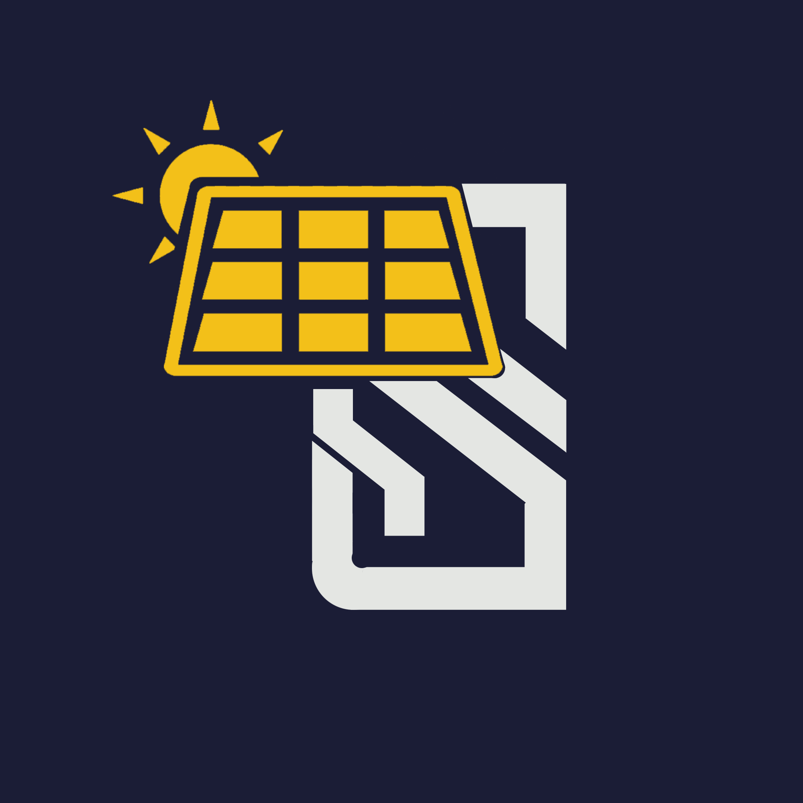

# Sunshine

# Project Overview

 
Sunshine app will help to empower and encourage solar energy among mass people and assist to keep track of the system of the installed solar system.

# Features

## _*Solar suitability of a location:*_

The users can check the solar suitability of installing solar panel of a particular location from our Sunshine app. After choosing the location from the map, a user can visualize the historical solar irradiance data and other useful relevant parameters like temperature, humidity, wind flow of that location and decide to install solar panel system. This will be done calling necessary API from NASA's POWER web portal.
 
 

## _*Calculating required number of solar panels:*_

When the user is convinced about the solar suitability of his location from the app, it will also assist the user in determining the required number of solar panels for his particular location and power consumption. The user will input the monthly power consumption of his residence and the wattage of the solar panel he is intending to use and the app will give an idea of installing how many solar panels will support how much percentage of his residence power consumption in a user friendly way.
 
 

## _*Keeping track of the installed solar panels:*_

The user can keep track whether his/her installed system is producing the optimum power or not from sunshine app. The user will create an account. Then he can note down the reading of daily power generation from the inverter of the installed solar system and input it to his account. These user data will be stored in his account. After that the user can see the comparison of power generation of his system and the sunlight coming from the sun in his location for any previous day(as long as the solar irradiance data of that day is available in NASA's website). If anything is wrong with the solar panel system, the user can easily identify that from this comparison.
 
 

## _*Encouraging lowering of carbon footprint:*_

When the user is saving his/her power generation data of a particular day, the app will also show him how much carbon footprint he/she is reducing by using solar panel for that day. The user is being awared how much he/she is contributing to the safe-keeping of the global environment.
 
 

## App Interface

### _*Home Page*_

- Introducing Sunshine
- Getting started

### _*Visualizer*_

- Changing the current location from the map.[default location is set to the user's location]
- Choose the parameters(solar irradiance, temperature, humidity, temperature) to visualize.

### _*Parameter's Page*_

- Choose the on which basis you want to visualize the data. [daily, monthly, yearly]
- Change the range of the visualized data

### _*User Account*_

- Sign up if you don't have an account otherwise login to your account.
- Input the power generation data of your solar panel system by clicking _*Input Daily Data*_.
- Check the comparison of your inputted data against the sunlight reaching your location.

### _*Solar Calculator*_

- Input the monthly power consumption in kw-hr of your residence and wattage of solar panel you are planning to use.
- Hit the calculate button to see the suggestiong about the number of solar panel for your setup and the amount of power they will support.
